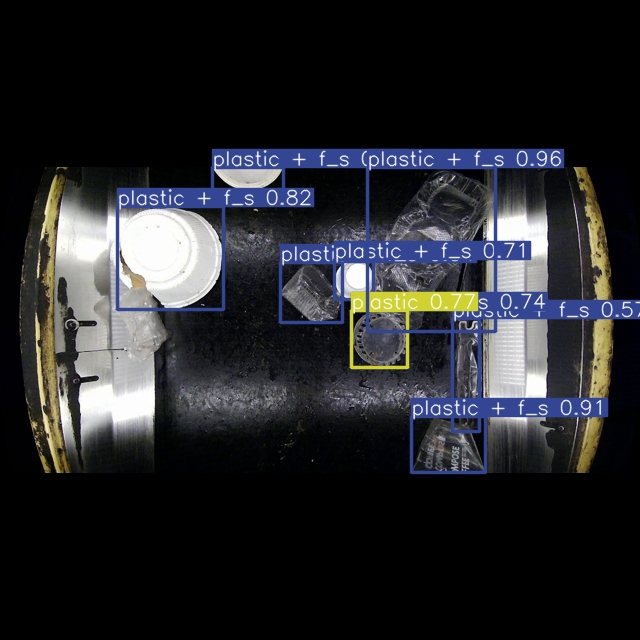
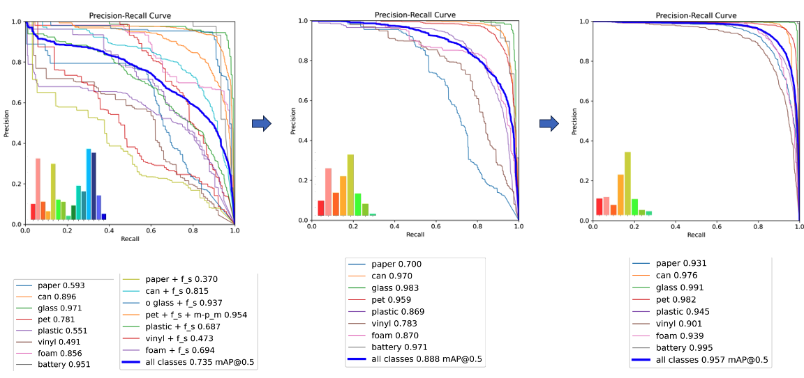

# Waste Sorting Vision

[](https://waste-sorting-vision.streamlit.app/)


YOLOv8-based household waste detection with a modular Streamlit inference app for image and video analysis.

[Live demo](https://waste-sorting-vision.streamlit.app/) • Tested locally with Homebrew Python `3.14`

## Overview

Waste Sorting Vision is a computer vision project for recognising common household waste categories.
It combines model inference, a lightweight Streamlit interface, and a concise set of project documents covering the main experimental results.

This public release is designed to be straightforward to run and easy to review.
The focus is on the working application, the class set used by the app, and the project outcomes that are most relevant in a portfolio context.

## App Preview

Sample detection output from the current application:



## Highlights

- image and video inference through a Streamlit app
- configurable checkpoint selection for local evaluation
- a 16-class application label set for household waste sorting
- annotated image download for quick result review
- project figures, result summaries, and workflow notes

## Results Snapshot

- the recorded training history covers `8`, `11`, `15`, and `16`-class settings
- the highest `mAP@50` listed in the summary table is `0.957`
- the current app exposes the 16-class interface used for image and video inference

Representative project figure:



Additional tables and figures are summarised in [docs/modeling_report.md](docs/modeling_report.md) and [docs/experiment_history.md](docs/experiment_history.md).

## Project Structure

- a thin Streamlit entry point in `app/streamlit_app.py`
- modular application logic under `src/waste_sorting_vision/`
- configurable class names, demo assets, and checkpoint locations in `configs/`
- project figures under `assets/figures/`
- supporting project notes under `docs/`

## Repository Layout

```text
waste-sorting-vision/
├─ app/
├─ assets/
├─ configs/
├─ docs/
├─ models/
├─ requirements/
├─ src/
└─ tests/
```

## Running The App

```bash
python -m venv .venv
source .venv/bin/activate
pip install -r requirements/app.txt
streamlit run app/streamlit_app.py
```

The commands above assume that `python` points to the interpreter you want to use for this project environment.
If you manage multiple Python installations locally, create the virtual environment with your preferred interpreter first and then activate `.venv`.

For the closest match to the tested local environment, install from `requirements/full-lock.txt` instead.

## Streamlit Deployment

For Streamlit Community Cloud deployment, use `app/streamlit_app.py` as the entry point.
This repository also includes a root `requirements.txt` so the deployment environment can resolve the application dependencies automatically.
It also includes a root `packages.txt` for the Linux system packages required by OpenCV in Community Cloud.

For deployment stability, choose Python `3.13` or `3.14` in the deployment settings when those options are available.

## Running Tests

```bash
source .venv/bin/activate
pip install -r requirements/dev.txt
pytest -p no:cacheprovider tests
```

## Checkpoint Configuration

The app exposes two model keys right now:

- `best`
- `best5`

Resolution order is:

1. matching environment variable
2. `models/` path configured in `configs/model_sources.yaml`

Environment variables:

- `WSV_MODEL_BEST`
- `WSV_MODEL_BEST5`

If you later decide to move the checkpoints outside the repository, point those environment variables to release assets, Git LFS files, or another artefact location.

## Key Docs

- [Project scope note](docs/reproducibility_note.md)
- [Environment reference](docs/environment_reference.md)
- [Class labels](docs/class_taxonomy_reconstruction.md)
- [Modelling report](docs/modeling_report.md)
- [Experiment history](docs/experiment_history.md)
- [Preprocessing summary](docs/preprocessing_summary.md)
- [Checkpoint storage strategy](docs/checkpoint_storage_strategy.md)

## Attribution

This repository presents the project as a standalone public release.
My original work on the project centred on detection model training, inference, and the end-to-end application workflow.
For this release, I also reorganised the repository, modularised the codebase, and prepared the documentation and configuration for a cleaner public-facing version.
