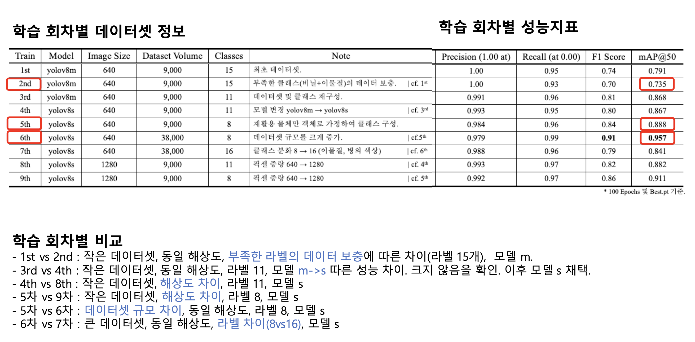

# Modelling Report

## Scope

This document highlights the main modelling outputs included in this repository.
It keeps the emphasis on project results that are useful for reviewing the work: figures, summary tables, and the overall progression across dataset size, class design, and model choice.

## Project Figures

### P-R Curve

Caption:
Precision-recall curve from the original YOLOv8 training workflow, included here as part of the project record.

### Training Result Figure

Caption:
Training result figure retained for project documentation.
For readability, the main experiment history is also summarised in table form in `docs/experiment_history.md`.

## Contribution Note

My work on the project centred on detection model training, inference, and application integration.

## Reading Guide

- The figures and tables in this document are presented as project results.
- The focus is on what the experiments achieved across dataset size, class design, and model choice.
- Low-level training implementation details that are not needed to understand the final app are intentionally kept brief in this public version.
